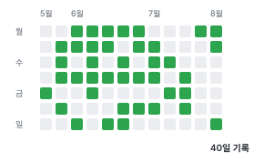

# TIL

오늘 배운 것은 오늘 쓰자.

## 학습 기록

## Network

- [TCP 3 way handshake & 4 way handshake](<network/tcp 3 way handshake & 4 way handshake/tcp 3 way handshake & 4 way handshake.md>)
- [TCP vs UDP](<network/TCP vs UDP/TCP vs UDP.md>)
- [TCP 헤더](<network/TCP 헤더/TCP 헤더.md>)
- [UDP 헤더](<network/UDP 헤더/UDP 헤더.md>)
- [SYN Flooding](<network/SYN Flooding/SYN Flooding.md>)
- [로드 밸런싱](<network/로드 밸런싱/로드 밸런싱.md>)
- [TCP 흐름제어](<network/TCP 흐름제어/TCP 흐름제어.md>)
- [TCP 혼잡제어](<network/TCP 혼잡제어/TCP 혼잡제어.md>)

## DB

- [트랜잭션 격리수준](<db/트랜잭션 격리수준/트랜잭션 격리수준.md>)
- [SQL Injection](<db/SQL Injection/SQL Injection.md>)
- [이상 현상](<db/이상 현상/이상 현상.md>)
- [낙관적 락 & 비관적 락](<db/낙관적 락 & 비관적 락/낙관적 락 & 비관적 락.md>)
- [JOIN 처리 방식과 최적화](<db/JOIN 처리 방식과 최적화/JOIN 처리 방식과 최적화.md>)
- [키](<db/키/키.md>)
- [MySQL vs PostgreSQL](<db/MySQL vs PostgreSQL/MySQL vs PostgreSQL.md>)

## Java

- [직렬화, 역직렬화, Serializable](<java/직렬화, 역직렬화, Serializable/직렬화, 역직렬화, Serializable.md>)
- [TreeSet](<java/TreeSet/TreeSet.md>)
- [PriorityQueue](<java/PriorityQueue/PriorityQueue.md>)

## Spring

- [예외 처리](<spring/예외 처리/예외 처리.md>)
- [application.yaml 환경 분리](<spring/application.yaml 환경 분리/application.yaml 환경 분리.md>)

## Development

- [단위 테스트 & 통합 테스트 & E2E 테스트 & 인수 테스트](<development/단위 테스트 & 통합 테스트 & E2E 테스트 & 인수 테스트/단위 테스트 & 통합 테스트 & E2E 테스트 & 인수 테스트.md>)

## Dev Log

- [메일 전송 기능 구현](<dev-log/메일 전송 기능 구현/메일 전송 기능 구현.md>)

## Project

- [알고리즘 사이트 배포 - 배포 (1)](<project/알고리즘 사이트 배포 - 배포 (1)/알고리즘 사이트 배포 - 배포 (1).md>)
- [알고리즘 사이트 배포 - 도메인 등록 (2)](<project/알고리즘 사이트 배포 - 도메인 등록 (2)/알고리즘 사이트 배포 - 도메인 등록 (2).md>)
- [알고리즘 사이트 배포 - HTTPS 설정 (3)](<project/알고리즘 사이트 배포 - HTTPS 설정 (3)/알고리즘 사이트 배포 - HTTPS 설정 (3).md>)
- [Google Analytics 붙이기](<project/Google Analytics 붙이기/Google Analytics 붙이기.md>)
- [Docker로 배포 관리하기](<project/Docker로 배포 관리하기/Docker로 배포 관리하기.md>)

## Ops

- [Private Repository Clone(with Fine-grained token)](<ops/Private Repository Clone(with Fine-grained token)/Private Repository Clone(with Fine-grained token).md>)

## AI

- [MCP](<ai/MCP/MCP.md>)
- [AI 활용 방식의 변화 (프롬프트 & 컨텍스트 & 에이전트)](<ai/AI 활용 방식의 변화 (프롬프트 & 컨텍스트 & 에이전트)/AI 활용 방식의 변화 (프롬프트 & 컨텍스트 & 에이전트).md>)
- [Codex CLI](<ai/Codex CLI/Codex CLI.md>)
- [스킬(Skill)](<ai/스킬(Skill)/스킬(Skill).md>)

## Web

- [쿠키 & 세션 & 토큰](<web/쿠키 & 세션 & 토큰/쿠키 & 세션 & 토큰.md>)
- [JWT](<web/JWT/JWT.md>)
- [Access Token & Refresh Token](<web/Access Token & Refresh Token/Access Token & Refresh Token.md>)
- [인증 & 인가](<web/인증 & 인가/인증 & 인가.md>)
- [Web Server & WAS](<web/Web Server & WAS/Web Server & WAS.md>)
- [CSRF](<web/CSRF/CSRF.md>)
- [XSS](<web/XSS/XSS.md>)
- [CORS](<web/CORS/CORS.md>)
- [웹 브라우저에 www.google.com을 입력하면?](<web/웹 브라우저에 www.google.com을 입력하면/웹 브라우저에 www.google.com을 입력하면.md>)

## Data Structure

- [레드-블랙 트리](<data-structure/레드-블랙 트리/레드-블랙 트리.md>)

## Algorithm

- [이분 탐색 & Lower Bound & Upper Bound](<algorithm/이분 탐색 & Lower Bound & Upper Bound/이분 탐색 & Lower Bound & Upper Bound.md>)

## TODO
- [ ] Logger
- [ ] 동시성 제어
- [ ] 대칭키, 비대칭키, TLS
- [ ] 멱등성, PUT, PATCH
- [ ] AOP
- [ ] Jackson 라이브러리
- [ ] Transactional, ReadOnly
