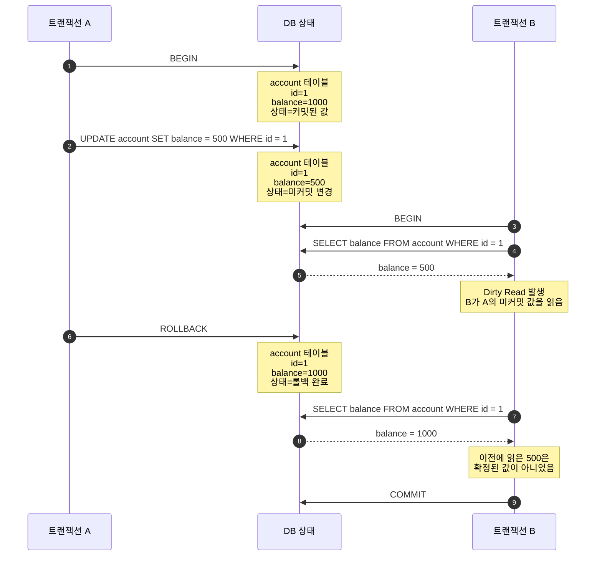
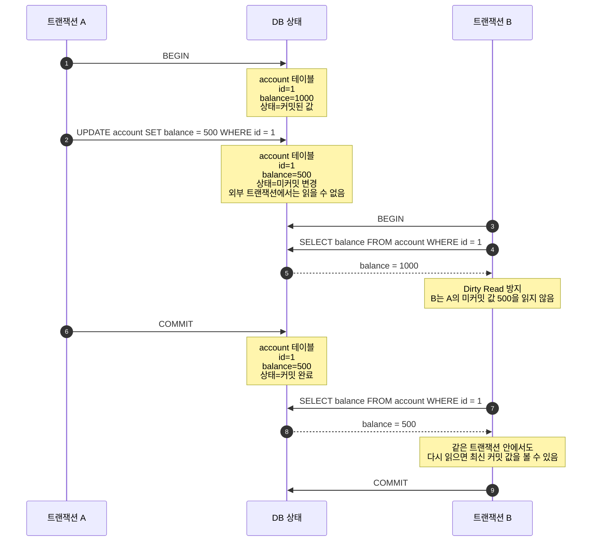
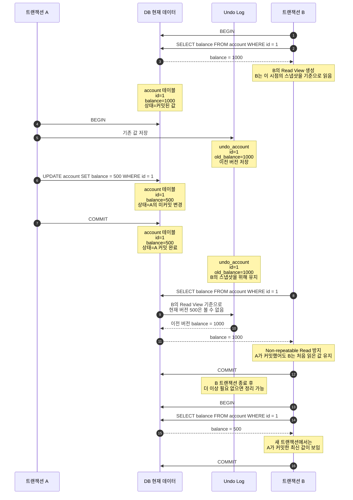

# 트랜잭션 격리수준

트랜잭션 격리수준은 동시에 실행되는 여러 트랜잭션이 서로의 변경 내용을 어디까지 볼 수 있는지 정하는 기준이다.

격리수준이 높아질수록 데이터 정합성은 높아지지만, 동시 처리 성능은 낮아질 수 있다.

## READ UNCOMMITTED

`READ UNCOMMITTED`는 커밋되지 않은 데이터까지 읽을 수 있는 격리 수준이다.

위 예시에서는 `트랜잭션 B`가 `트랜잭션 A`의 미커밋 값인 `balance = 500`을 읽는 `Dirty Read`가 발생한다.
이후 `트랜잭션 A`가 `ROLLBACK`되면, `트랜잭션 B`가 읽은 값은 실제로 확정된 값이 아니게 되므로 문제가 생긴다.

## READ COMMITTED

`READ COMMITTED`는 커밋된 데이터만 읽을 수 있는 격리 수준이다.

위 예시에서는 `트랜잭션 A`가 `COMMIT`하기 전까지 `트랜잭션 B`는 `balance = 500`을 읽지 않아 `Dirty Read`가 발생하지 않는다.

하지만 `트랜잭션 A`가 `COMMIT`한 뒤 다시 조회하면 `balance = 500`을 읽는 `Non-repeatable Read`가 발생한다.

## REPEATABLE READ

`REPEATABLE READ`는 같은 트랜잭션 안에서 같은 데이터를 반복 조회해도 같은 결과를 보장하는 격리 수준이다.

`REPEATABLE READ`는 변경 전 레코드를 `Undo Log`에 저장한다.
데이터를 조회할 때 현재 트랜잭션보다 이후에 변경된 데이터가 있다면 `Undo Log`를 참고해서 이전 값을 읽는다.
같은 조건으로 다시 조회했을 때 이전에 없던 레코드가 새로 보이는 `Phantom Read` 현상은 발생할 수 있다. 다만 `MySQL InnoDB`는 `Gap Lock`을 사용해 이 문제를 방지할 수 있다.

## SERIALIZABLE

`SERIALIZABLE`은 트랜잭션을 순차적으로 실행하는 가장 엄격한 격리 수준이다.

`SERIALIZABLE`은 여러 트랜잭션이 같은 레코드에 동시에 접근하지 못하게 제한한다.
순수한 `SELECT` 작업에서도 대상 레코드에 `Lock`을 건다.

가장 안전하지만 성능 비용이 크기 때문에, 극단적으로 안전한 작업이 필요한 경우가 아니라면 사용을 피하는 것이 좋다.

## 정리

### 트랜잭션 격리수준

| 격리 수준 | 설명 | 특징 |
| --- | --- | --- |
| `READ UNCOMMITTED` | 커밋되지 않은 데이터도 읽을 수 있다. | 정합성이 가장 낮다. |
| `READ COMMITTED` | 커밋된 데이터만 읽을 수 있다. | 일반적으로 많이 사용된다. |
| `REPEATABLE READ` | 같은 트랜잭션 안에서 반복 조회 결과를 보장한다. | MySQL InnoDB의 기본 격리 수준이다. |
| `SERIALIZABLE` | 트랜잭션을 순차적으로 실행하는 것처럼 처리한다. | 가장 안전하지만 가장 느리다. |

### 발생 가능 문제

| 격리 수준 | `Dirty Read` | `Non-repeatable Read` | `Phantom Read` |
| --- | --- | --- | --- |
| `READ UNCOMMITTED` | O | O | O |
| `READ COMMITTED` | X | O | O |
| `REPEATABLE READ` | X | X | O |
| `SERIALIZABLE` | X | X | X |

대부분의 SQL Server는 기본 격리 수준으로 `READ COMMITTED`를 사용한다.
MySQL InnoDB는 기본 격리 수준으로 `REPEATABLE READ`를 사용한다.
