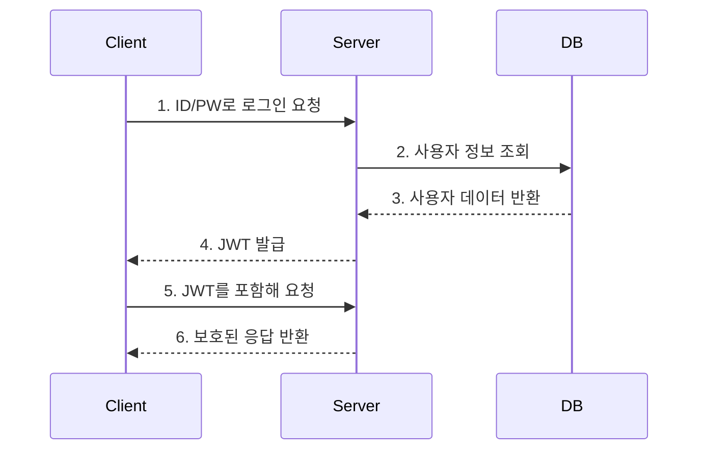

# JWT(JSON Web Token)

JWT(JSON Web Token)란 인증에 필요한 정보들을 암호화시킨 JSON 토큰이다.

JWT는 JSON 데이터를 Base64 URL-safe Encode를 통해 인코딩하여 직렬화한 것이며, 토큰 내부에는 위변조 방지를 위해 개인키를 통한 전자서명도 들어있다.
> Base64 URL-safe Encode:일반적인 Base64 Encode 에서 URL 에서 오류없이 사용하도록 '+', '/' 를 각각 '-', '_' 로 표현한 것이다.
>
> Base64 Encode : Binary Data를 Text로 바꾸는 Encoding

## JWT 로그인 흐름


1. 사용자가 ID와 PW를 입력해 서버에 로그인 요청을 보낸다.
2. 서버는 DB에서 해당 사용자가 존재하는지 확인한다.
3. DB 조회 결과 회원 정보가 유효하면 서버는 사용자를 인증한다.
4. 서버는 사용자에게 JWT를 발급해 응답한다.
5. 이후 요청부터는 사용자가 JWT와 함께 요청한다.
6. 검증이 완료되면 요청한 응답을 돌려준다

## JWT 구조
JWT는`.`을 구분자로 나누어지는 세 가지 문자열의 조합이다.
`.`을 기준으로 좌측부터 Header,Payload,Signature를 의미한다.

```text
base64UrlEncode(Header).base64UrlEncode(Payload).Signature
```

| Header | Payload | Signature |
| --- | --- | --- |
| `{`<br>`  "alg": "HS256",`<br>`  "typ": "JWT"`<br>`}` | `{`<br>`  "sub": "user-1",`<br>`  "name": "박영규",`<br>`  "role": "USER",`<br>`  "iat": 1718678400,`<br>`  "exp": 1718682000`<br>`}` | `HMACSHA256(`<br>`  base64UrlEncode(header) + "." +`<br>`  base64UrlEncode(payload),`<br>`  secret`<br>`)` |

### Header
토큰의 타입과 서명 알고리즘 정보를 담는다.
- `alg` : 서명 알고리즘
- `typ` : 토큰 타입

### Payload
사용자 식별 정보와 토큰의 부가 정보를 담는다.
- `sub` : 토큰의 주체, 보통 사용자 식별자가 들어간다.
- `name` : 사용자 이름
- `role` : 권한
- `iat` : 발급 시간
- `exp` : 만료 시간

Payload는 암호화된 값이 아니라 Base64 URL-safe 방식으로 인코딩된 값이다.
따라서 비밀번호, 주민등록번호 같은 민감 정보는 Payload에 넣으면 안 된다.

#### Registered Claims

[RFC 7519 Section 4.1 - Registered Claim Names](https://datatracker.ietf.org/doc/html/rfc7519#section-4.1)

JWT에서 미리 정의해둔 표준 클레임이다.
모든 클레임이 필수는 아니지만, 토큰의 의미를 명확히 하기 위해 사용된다.

- `iss` : Issuer, 토큰 발급자
- `sub` : Subject, 토큰의 주체
- `aud` : Audience, 토큰의 대상자
- `exp` : Expiration Time, 토큰 만료 시간
- `nbf` : Not Before, 이 시간 전에는 토큰 사용 불가
- `iat` : Issued At, 토큰 발급 시간
- `jti` : JWT ID, 토큰의 고유 식별자

#### Public Claims

[RFC 7519 Section 4.2 - Public Claim Names](https://datatracker.ietf.org/doc/html/rfc7519#section-4.2)

사용자 정의 클레임이며, 다른 클레임 이름과 충돌하지 않도록 공개적으로 충돌 방지 가능한 이름을 사용한다.
보통 URI 형식을 사용해 어떤 주체가 정의한 클레임인지 명확히 한다.

내 애플리케이션에서 role을 정의하고 싶다면 아래와 같이 작성한다.
```json
{
  "https://my-program.com/role": "USER"
}
```

#### Private Claims

[RFC 7519 Section 4.3 - Private Claim Names](https://datatracker.ietf.org/doc/html/rfc7519#section-4.3)

JWT를 주고받는 당사자들끼리 합의해서 사용하는 사용자 정의 클레임이다.
일반적으로 서버와 클라이언트 사이에서 정해놓은 약속에 맞추어 사용한다.
이름이 중복되어 충돌 될 수 있으니 사용할 때 유의해야 한다.

```json
{
  "userId": 1,
  "team": "backend"
}
```

#### Payload 예시

Registered Claims, Public Claims, Private Claims는 Payload 안에서 별도 영역으로 나뉘지 않는다.
하나의 JSON 객체 안에 함께 저장된다.

```json
{
  "iss": "youngkyu-server",
  "sub": "user-1",
  "exp": 1718682000,
  "iat": 1718678400,

  "https://youngkyu.com/role": "USER",

  "userId": 1,
  "team": "backend"
}
```

### Signature

Signature는 Header와 Payload가 위변조되지 않았는지 검증하기 위한 값이다.

JWT는 Header와 Payload를 Base64 URL-safe 방식으로 인코딩한 뒤, 두 값을 `.`으로 연결한다.
그리고 이 문자열을 서버의 비밀키와 Header에 명시된 알고리즘으로 서명한다.

```text
Signature =
HMACSHA256(
  base64UrlEncode(Header) + "." + base64UrlEncode(Payload),
  secret
)
```

#### 서명 예시

아래와 같은 Header와 Payload가 있다고 가정한다.

```json
{
  "alg": "HS256",
  "typ": "JWT"
}
```

```json
{
  "sub": "user-1",
  "name": "박영규",
  "role": "USER",
  "iat": 1718678400,
  "exp": 1718682000
}
```

먼저 Header와 Payload를 각각 Base64 URL-safe 방식으로 인코딩한다.

```text
base64UrlEncode(Header)
base64UrlEncode(Payload)
```

그 다음 두 값을 `.`으로 연결한다.

```text
base64UrlEncode(Header) + "." + base64UrlEncode(Payload)
```

마지막으로 연결한 문자열을 서버의 비밀키로 서명한다.

```text
HMACSHA256(
  base64UrlEncode(Header) + "." + base64UrlEncode(Payload),
  secret
)
```

이렇게 만들어진 서명값이 JWT의 세 번째 부분인 Signature가 된다.

```text
base64UrlEncode(Header).base64UrlEncode(Payload).Signature
```

만약 누군가 Payload의 `role`을 `USER`에서 `ADMIN`으로 바꾸면, 서버가 다시 계산한 Signature와 토큰에 들어있는 Signature가 달라진다.
따라서 서버는 Signature를 비교해 토큰이 위변조되었는지 확인할 수 있다.

## 실습

https://www.jwt.io/ 에서 실제로 JWT를 만들어볼 수 있다.
