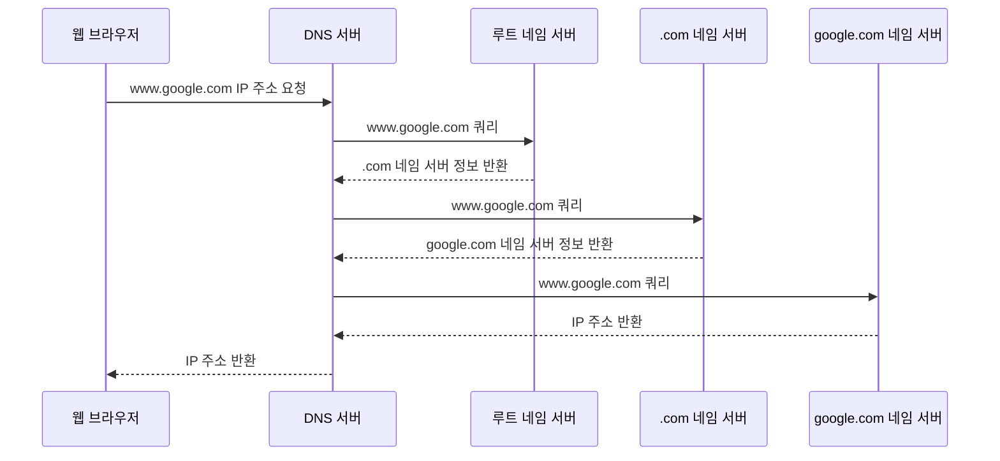

# 웹 브라우저에 `www.google.com`을 입력하면?

## 1. DNS 캐시 조회

1. 웹 브라우저의 DNS 캐시 확인
2. OS의 DNS 캐시 확인
3. 라우터의 DNS 캐시 확인
4. ISP의 DNS 서버 캐시 확인

## 2. DNS 쿼리

캐시에 도메인 정보가 없다면 DNS 서버를 통해 해당 도메인의 IP 주소를 얻어야 한다. 이를 DNS 쿼리라고 한다.
DNS 서버는 `www.google.com`을 호스팅하는 서버의 IP 주소를 찾는다.

DNS 쿼리는 다음과 같이 수행된다.

1. DNS 서버가 루트 네임 서버에 `www.google.com`을 쿼리한다.
2. 루트 네임 서버가 `.com` 네임 서버의 정보를 반환한다.
3. DNS 서버가 `.com` 네임 서버에 쿼리한다.
4. `.com` 네임 서버가 `google.com` 네임 서버의 정보를 반환한다.
5. DNS 서버가 `google.com` 네임 서버에서 `www.google.com`의 IP 주소를 받아 브라우저에 반환한다.

## 3. TCP 연결

웹 브라우저와 Google 서버는 `TCP 3-way handshake`를 통해 연결한다.

## 4. TLS 연결

웹 브라우저와 Google 서버는 `TLS handshake`를 통해 암호화 통신에 사용할 대칭키를 생성한다.

## 5. HTTP 요청과 응답

1. 웹 브라우저가 서버에 HTTP 요청을 보낸다.
2. 서버가 요청을 처리한다.
3. 서버가 처리 결과를 웹 브라우저에 응답으로 전달한다.

## 6. 브라우저 렌더링

웹 브라우저가 응답받은 HTML 문서를 해석해 화면에 표시한다.
