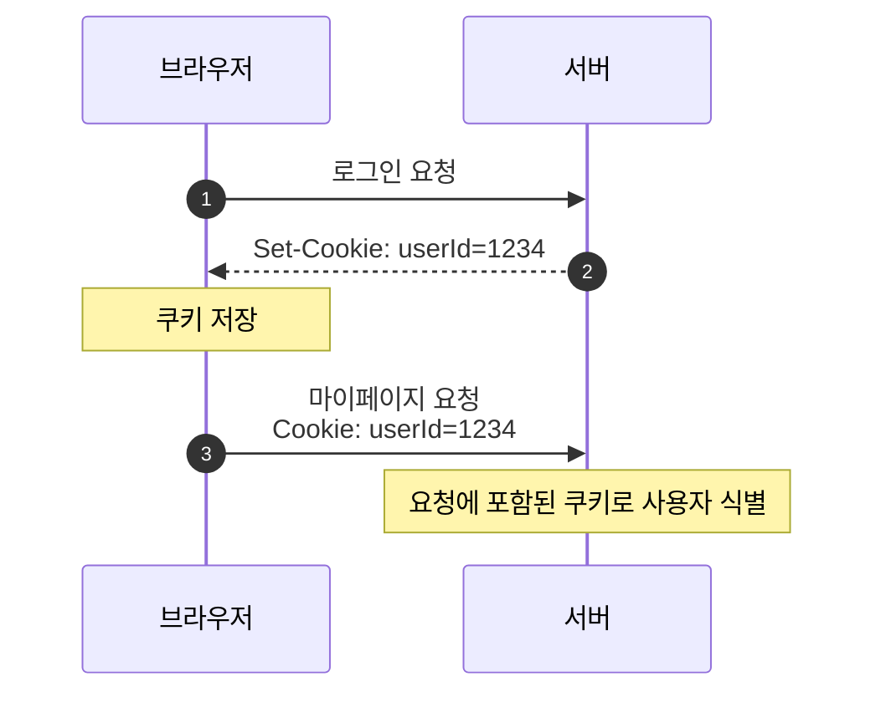
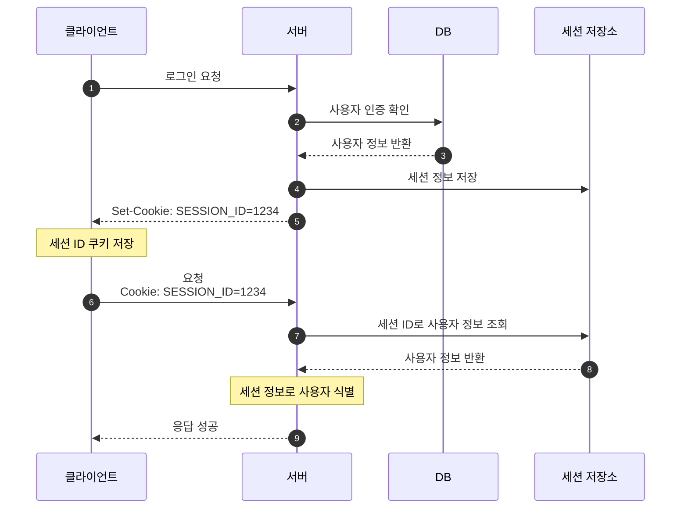
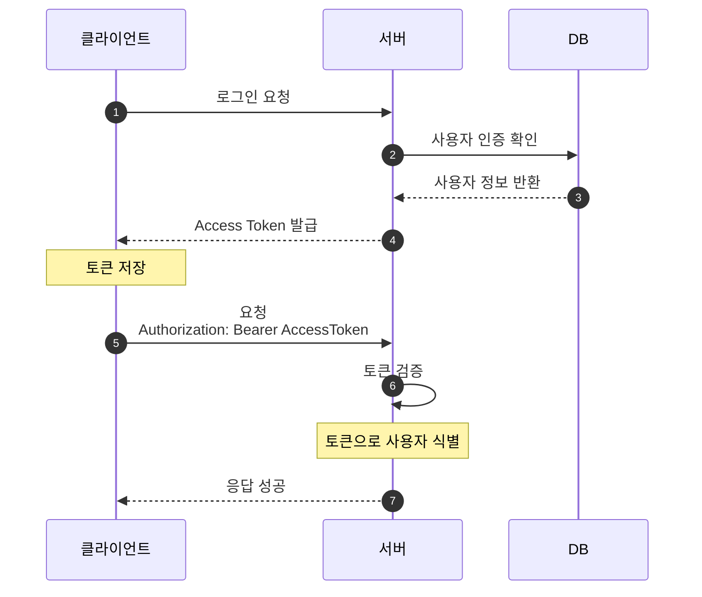

# 쿠키 & 세션 & 토큰

HTTP는 요청과 응답이 끝나면 이전 요청 상태를 기억하지 않는 Stateless한 프로토콜이다.
로그인과 같은 일을 할 때, '누가' 로그인 중인지 상태를 기억하기 위해 쿠키, 세션, 토큰을 사용한다.

## 쿠키
> HTTP 쿠키란 웹 서버에 의해 사용자의 컴퓨터에 저장되는, '이름을 가진 작은 크기의 데이터'이다. 인터넷 사용자가 어떠한 웹사이트를 방문할 경우 사용자의 웹 브라우저를 통해 인터넷 사용자의 컴퓨터나 다른 기기에 설치되는 **작은 기록 정보 파일**을 일컫는다.
- Key-Value 형식의 문자열

### 인증 과정

- Server가 HTTP 응답 헤더의 Set-Cookie에 데이터를 담는다.
- 웹 브라우저가 이 쿠키를 저장하고, 이후 클라이언트는 매 요청마다 요청 헤더에 Cookie를 담아 보낸다.

### 단점
- 쿠키의 값을 그대로 보내기 때문에 유출 및 조작 당할 위험이 존재한다. 보안에 취약하다.
- 용량 제한이 있다.
- 웹 브라우저마다 쿠키에 대한 지원 형태가 다르기 때문에 브라우저 간 공유가 불가능하다.
- 쿠키의 사이즈가 커질수록 네트워크에 부하가 심해진다.

> 쿠키 사양상 브라우저는 최소한 다음 수준을 지원해야 한다.
> - 쿠키 1개당 최소 `4096 bytes`
> - 도메인당 최소 `50개`의 쿠키
> - 전체 최소 `3000개`의 쿠키
> 
## 세션

이러한 쿠키의 보안 이슈 때문에, 세션은 비밀번호 등 클라이언트의 민감한 인증 정보를 브라우저가 아닌 서버 측에 저장하고 관리한다.
민감한 정보 대신 클라이언트에서는 서버의 세션 ID를 쿠키로 저장한다.

세션 객체는 Key에 해당하는 세션 ID와 이에 대응하는 Value로 구성되어 있다.
Value에는 세션 생성 시간, 마지막 접근 시간, User 속성 등이 Map 형태로 저장된다.

세션 저장소로는 메모리, DB, Redis 등을 사용할 수 있다.

### 인증 과정

### 단점

- **세션 ID 자체를 탈취하면 클라이언트인 척 위장할 수 있다**는 한계가 있다.
- 서버에서 세션 저장소를 사용하므로 요청이 많아지면 서버에 부하가 심해진다.

## 토큰

- 클라이언트가 인증에 성공하면 서버는 인증 정보를 담은 토큰을 발급한다.
- 기존의 세션 기반 인증 방식은 서버가 세션 정보를 가지고 있어야 하고, 이를 조회해야 하기 때문에 많은 오버헤드가 발생한다.
- 반면 토큰은 서버가 아닌 클라이언트에 저장되기 때문에 서버의 부담을 덜 수 있다. 토큰의 서명, 만료 시간, 권한 등을 검증하면 된다.
- 웹과 모바일에서 모두 사용하기 쉽다.

### 인증 과정

### 단점
- 쿠키/세션과 다르게 토큰 자체의 데이터 길이가 길어, 인증 요청이 많아질수록 네트워크 부하가 심해질 수 있다.
- 토큰을 탈취당하면 대처하기 어렵다. (사용 기간을 제한하는 방식으로 해결하기도 한다.)

> 토큰은 보통 응답 Body로 내려주거나, `Set-Cookie` 헤더에 담아 쿠키로 저장시킬 수 있다.
> `Authorization` 헤더는 클라이언트가 서버에 토큰을 보낼 때 사용한다.
> 예: `Authorization: Bearer <AccessToken>`

## REFERENCE
- https://inpa.tistory.com/entry/WEB-%F0%9F%93%9A-JWTjson-web-token-%EB%9E%80-%F0%9F%92%AF-%EC%A0%95%EB%A6%AC#cookie_%EC%9D%B8%EC%A6%9D
